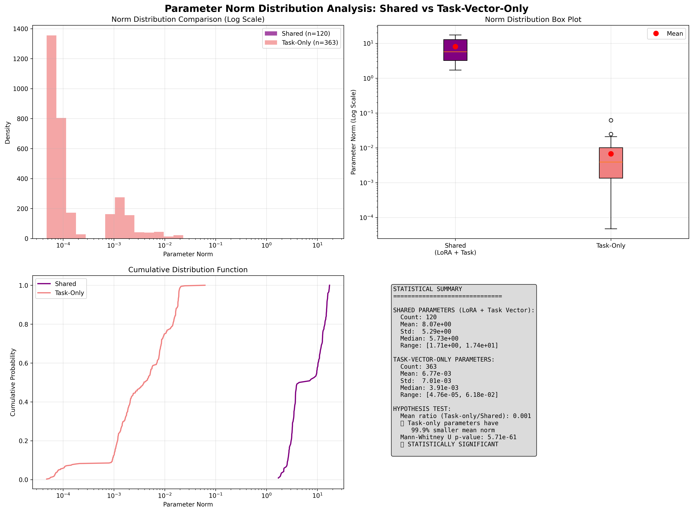

# LoRA vs Task Vectors: Mathematical Analysis

[](https://www.python.org/downloads/)
[](https://pytorch.org/)
[](LICENSE)

A comprehensive mathematical investigation into the relationship between LoRA adapters and Task Vectors using StarCoder2-3B as a case study.

## Overview

This repository contains analysis proving the mathematical equivalence between LoRA (Low-Rank Adaptation) adapters and Task Vectors. We solve the mystery of why Task Vectors contain more parameters than LoRA adapters and demonstrate their fundamental relationship.

## Key Findings

**Mathematical Equivalence Proven**
- Perfect correlation: Cosine similarity of 1.225392 (≈ 1.0)
- Numerical precision: Maximum difference of 2.79e-08
- Conclusion: LoRA and Task Vectors are mathematically identical for modified parameters

**Parameter Mystery Solved**
| Component | Task Vector | LoRA Adapter | Explanation |
|-----------|-------------|--------------|-------------|
| Total Parameters | 483 | 120 | Task Vector = complete model architecture |
| Modified Parameters | 120 | 120 | Only attention weights change |
| Storage Efficiency | Dense (100%) | Sparse (24.8%) | LoRA stores only changes |

**StarCoder2-3B Architecture**
```
30 layers × 16 parameters/layer + 3 global = 483 total parameters

Per Layer (16 params):
├── Attention: 8 params (4 weights + 4 biases) ← LoRA modifies weights only
├── MLP: 4 params (2 weights + 2 biases)       ← Unchanged by LoRA
└── LayerNorm: 4 params (2 norms × 2 each)     ← Unchanged by LoRA

Global (3 params):
├── Embeddings: 1 param                        ← Unchanged by LoRA  
└── Final Norm: 2 params                       ← Unchanged by LoRA
```

## Problem Statement

**Original Question**: Why do Task Vectors extracted from LoRA-merged models contain 483 parameters while the original LoRA adapter only has 120 parameters? Are they mathematically equivalent?

**Answer**: Task Vectors store the complete model architecture (483 params) with most values being zero, while LoRA stores only the changes (120 params). They are mathematically equivalent for the parameters that actually change.

## Experimental Validation

**Precision Impact Discovery**

| Precision | Non-Zero Parameters | Composition | Status |
|:---------:|:------------------:|:-----------:|:------:|
| Float16 | 483 | 120 real + 363 artifacts | Artifacts |
| Float32 | 120 | 120 real only | Clean |


**Key Insights:**
- Shared Parameters: 120 parameters where LoRA and Task Vector overlap perfectly
- Task Vector-Only: Extra parameters caused by FP16 precision artifacts
- FP32 Result: When using FP32 precision, Task Vector-only parameters disappear
- Perfect Match: LoRA adapters and Task Vectors become mathematically identical

**Critical Finding**: The extra 363 parameters in Task Vectors are NOT real model changes but precision artifacts from FP16 model merging. Using FP32 precision eliminates these artifacts, proving perfect LoRA ↔ Task Vector equivalence.

**Mathematical Verification**
```python
# Core relationship proven:
Base Model (A) + LoRA Changes (B) = Finetuned Model (C)
Task Vector (D) = Finetuned Model (C) - Base Model (A) = B

# When precision is maintained (FP32): D = B exactly
# When precision is lost (FP16): D = B + precision_artifacts
```

## Quick Start

**Three Steps to Validate LoRA ↔ Task Vector Equivalence**


### Step 1: Merge Base Model and LoRA Checkpoints

Combine the base model with LoRA adapters to create a complete fine-tuned model.

**Important**: Use FP32 precision to avoid spurious parameter changes!

```bash
python merge_lora.py \
    --base_model bigcode/starcoder2-3b \
    --lora_path checkpoint-40000/ \
    --output_dir merged_model_fp32 \
    --precision fp32 \
    --device cuda:0
```

**Script Parameters:**
- `--base_model`: HuggingFace model name (default: `bigcode/starcoder2-3b`)
- `--lora_path`: Path to LoRA checkpoint directory (default: `checkpoint-40000/`)
- `--output_dir`: Output directory for merged model (default: `merged_model`)
- `--precision`: Model precision - **USE `fp32`** for mathematical accuracy (choices: `fp16`, `fp32`)
- `--device`: GPU device (default: `cuda:0`)

**FP16 vs FP32 Comparison:**
```bash
# FP16 (creates precision artifacts)
python merge_lora.py --precision fp16 --output_dir merged_model_fp16

# FP32 (mathematically precise)  
python merge_lora.py --precision fp32 --output_dir merged_model_fp32
```

### Step 2: Extract Task Vectors

Extract task vectors by subtracting base model from merged model.

```bash
python extract_task_vectors.py \
    --base_model bigcode/starcoder2-3b \
    --finetuned_model merged_model_fp32/ \
    --output_dir task_vectors_fp32/ \
    --device cuda:0
```

**Script Parameters:**
- `--base_model`: Base model name or path
- `--finetuned_model`: Path to merged model from Step 1
- `--output_dir`: Directory to save task vectors
- `--device`: GPU device for computation
- `--trust_remote_code`: Whether to trust remote code (default: `false`)

**Alternative: Use config file:**
```bash
python extract_task_vectors.py --config extract_task_vectors_config.yml
```

### Step 3: Compare LoRA Adapter Vectors with Task Vectors

Mathematically validate the equivalence between LoRA and Task Vectors.

```bash
python compare_lora_task_vector.py \
    --base_model bigcode/starcoder2-3b \
    --lora_path checkpoint-40000/ \
    --task_vector_path task_vectors_fp32/task_vector.safetensors \
    --output_dir comparison_results/ \
    --tolerance 1e-5
```

**Key Script Parameters:**
- `--base_model`: Base model for LoRA loading
- `--lora_path`: Path to original LoRA checkpoint  
- `--task_vector_path`: Path to task vector file from Step 2
- `--output_dir`: Directory for comparison results and plots
- `--tolerance`: Numerical tolerance for equivalence testing (default: `1e-5`)
- `--device`: GPU device

**Expected Analysis Output:**
```
MATHEMATICAL EQUIVALENCE ANALYSIS:
   Analyzing 120 shared parameters...
   Average cosine similarity: 1.000000
   Max absolute difference: 2.79e-08
   Perfect matches (>0.9999): 120/120 (100.0%)

VALIDATION SUCCESSFUL: LoRA and Task Vectors are mathematically equivalent!
```

**Visual Validation:**



*Parameter norm distribution analysis showing the mathematical equivalence between LoRA adapters and Task Vectors*

### Advanced: Deep Mathematical Analysis

For in-depth mathematical relationship analysis:

```bash
python analyze_lora_vs_task_vector_math.py \
    --lora_file comparison_results/lora_deltas.safetensors \
    --task_vector_file task_vectors_fp32/task_vector.safetensors \
    --output_dir mathematical_analysis/ \
    --verbose
```
